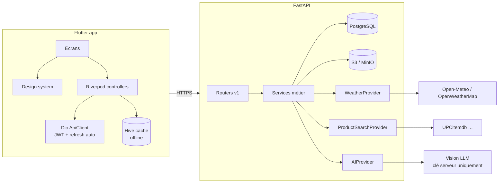

# Architecture

## Choix mobile : Flutter (vs React Native)

Décision : **Flutter 3.x**, une seule codebase iOS/Android.

| Critère | Flutter | React Native |
|---|---|---|
| Animations premium 60/120 fps | ✅ moteur Impeller, contrôle pixel | correct mais bridge/JS |
| Caméra + scan codes-barres | `mobile_scanner` (ML Kit natif) mature | équivalent mais intégrations plus variables |
| Rendu 3D (GLB/GLTF, USDZ iOS) | `model_viewer_plus` stable | dépend de WebView custom |
| Cohérence UI iOS+Android | un seul design system, rendu identique | dépend des composants natifs |
| Maintenance monorepo + tests | `flutter test` + analyze intégrés | chaîne plus fragmentée |

Les rares parties natives (permissions, keychain/keystore) restent gérées par des plugins éprouvés (`flutter_secure_storage`, `geolocator`).

## Vue d'ensemble

## Principes

1. **Providers interchangeables** : `WeatherProvider`, `ProductSearchProvider`, `AIProvider` — registre + sélection par variable d'environnement. Aucune logique métier ne dépend d'un fournisseur précis.
2. **IDOR-proof par construction** : toutes les requêtes de lecture/écriture sont scopées par `user_id` (jamais de `WHERE id = :id` seul). Testé (`tests/test_authorization.py`).
3. **IA sans invention** : sorties structurées validées par Pydantic ; confiance bornée ; candidats confirmés par l'utilisateur avant application.
4. **Explicabilité** : chaque recommandation stocke son snapshot météo et ses explications.
5. **Privacy by design** : pas de PII dans les logs, IP hachées dans l'audit, export RGPD, suppression réelle.

## Modules backend (`apps/api/app/modules/`)

| Module | Responsabilité |
|---|---|
| `users` | comptes, préférences, sessions, auth |
| `wardrobe` | catégories, vêtements, images, candidats d'identification |
| `outfits` | tenues, historique de port |
| `weather` | providers + snapshots |
| `locations` | villes enregistrées / destinations |
| `recommendations` | moteur + persistance + feedback |
| `product_search` | providers de recherche produit |
| `product_recognition` | pipeline OCR/vision |
| `media` | uploads signés S3, validation MIME/taille |
| `notifications` | préférences de notification |
| `privacy` | export RGPD |
| `audit` | trail d'audit sécurité |

## Mobile (`apps/mobile/lib/`)

- `core/` : config, thème (clair/sombre), widgets partagés (skeletons, empty states, erreurs), réseau (Dio + refresh), modèles.
- `features/` : auth, home, wardrobe (+ silhouette), recommendation (flow outfit), mannequin (abstraction 3D), location, settings.
- Offline : cache Hive de la garde-robe et de la dernière recommandation ; resynchronisation au retour réseau (refresh en arrière-plan).
